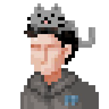

# Welcome to Etienne's website for CSE 110 Lab 1!

*Contents/Section Links:*
1. [Intro](#intro)
2. [Stuff](#stuff)
3. [Hobbies](#hobbies)
4. [Interests](#interests)

## Intro

Hi! I'm *Etienne*, and I'm a second-year Computer Engineering student at **UC San Diego**. I have some experience programming in **C**, **C++**, and **Java**. [Here](https://github.com/Etienne0601) is a link to my GitHub profile.

## Stuff

Here is my current GitHub profile picture:



Here are some of the files in this GitHub repository:
- [This](./README.md) is a relative link to README.txt
- [This](./index.md) is a relative link to index.md
- [This](./.gitignore) is a relative link to .gitignore
- [This](./profile_pic.png) is a relative link to profile_pic.png

## Hobbies

My hobbies include ~~breaking~~ fixing things, fiddling with electronics and circuits, going on walks, gardening, and playing video games.

## Interests

I enjoy learning about a variety of subjects, here's a short subset of the interests and activities that I have and have not explored, in task list form:
- [X] Basic Electronics and Circuits
- [X] Basic Programming
- [X] Linux related projects, such as making my own backup server, for example
- [ ] Cryptography
- [ ] Amateur Radio and DIY Radio
- [ ] Understanding already written code and reverse engineering code
- [ ] Coding a Simple Multiplayer Game from start to finish
- [ ] Making a useful Arduino or Raspberry Pi project
- [ ] Etc...

## Code Example

One day I woke up and learned to write this piece of code:
```cpp
#include <iostream>

int main() {
    std::cout << "Hello World!" << std::endl;
    return 0;
}
```
And then I said:
> Wow, what a neat piece of code!